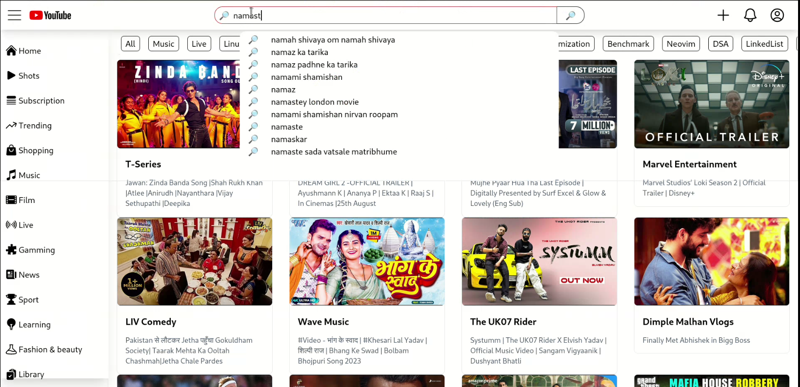

<br/>
<p align="center">
  <a href="https://github.com/urstrulypriyank/youtube-react-clone">
    
  </a>

  <h3 align="center">Opensource React Client</h3>

  <p align="center">
    Fast, Performant Youtube react client built using public API of youtube
    <br/>
    <br/>
    <a href="https://github.com/urstrulypriyank/youtube-react-clone"><strong>Explore the docs »</strong></a>
    <br/>
    <br/>
    <a href="https://github.com/urstrulypriyank/youtube-react-clone">View Demo</a>
    .
    <a href="https://github.com/urstrulypriyank/youtube-react-clone/issues">Report Bug</a>
    .
    <a href="https://github.com/urstrulypriyank/youtube-react-clone/issues">Request Feature</a>
  </p>
</p>

   

## Table Of Contents

- [About the Project](#about-the-project)
- [Built With](#built-with)
- [Getting Started](#getting-started)
  - [Prerequisites](#prerequisites)
  - [Installation](#installation)
- [Usage](#usage)
- [Contributing](#contributing)
- [License](#license)
- [Authors](#authors)
- [Acknowledgements](#acknowledgements)

## About The Project



It is open source youtube client built using
The main Features and practices include are:<br>
✅ TailwindCSS for rapid prototyping, react-router-dom for routing <br>
✅ Used Redux for state management <br>
✅ Implemented Search and search suggestion Functionality with debouncing and search result caching <br>
✅ Used Lazy loading for optimization and reduced overall loading time <br>
✅ N-level deep nested comments section, Live Chats with API Pooling functionality <br>

## Built With

Vite | React | Redux | TailwindCSS | Youtube Publi API | react-router-dom | Heroicons

## Getting Started

This is an example of how you may give instructions on setting up your project locally.
To get a local copy up and running follow these simple example steps.

### Prerequisites

This is an example of how to list things you need to use the software and how to install them.

- NodeJs

```sh
apt install nodejs
```

- npm

```sh
npm install npm@latest -g
```

### Installation

1. Get a free API Key at [https://console.cloud.google.com/](https://console.cloud.google.com/apis/credentials)

2. Clone the repo

```sh
       git clone https://github.com/urstrulypriyank/youtube-react-clone.git
```

3. Install NPM packages

```sh
       npm install
```

4. Enter your API in `.env`

```JS
VITE_YT_API_KEY  = 'ENTER YOUR API KEY';
```

## Usage

Use this space to show useful examples of how a project can be used. Additional screenshots, code examples and demos work well in this space. You may also link to more resources.

_For more examples, please refer to the [Documentation](https://example.com)_

## Contributing

Contributions are what make the open source community such an amazing place to be learn, inspire, and create. Any contributions you make are **greatly appreciated**.

- If you have suggestions for adding or removing features, feel free to [open an issue](https://github.com/urstrulypriyank/youtube-react-clone/issues/new) to discuss it, or directly create a pull request after you edit.

### Creating A Pull Request

1. Fork the Project
2. Create your Feature Branch (`git checkout -b feature/AmazingFeature`)
3. Commit your Changes (`git commit -m 'Add some AmazingFeature'`)
4. Push to the Branch (`git push origin feature/AmazingFeature`)
5. Open a Pull Request

## License

Distributed under the MIT License. See [LICENSE](https://github.com/urstrulypriyank/youtube-react-clone/blob/main/LICENSE.md) for more information.

## Authors

- **Priyank Rai** - _Freelancer_ - [Priyank Rai](https://github.com/urstrulypriyank) - _Developer_

## Acknowledgements

- [Priyank Rai](https://github.com/urstrulypriyank)
